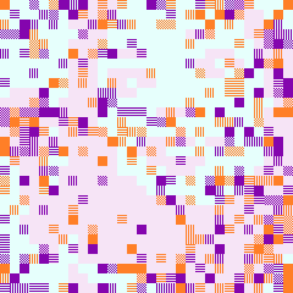

# Soothe

This is our digital life. 

It is full of noise. But anyways, we try to find something out of this noise. Behind every text message, behind every voice note, behind every selfie we take and every nude we send, what we look for is interaction with people. To _soothe_ ourselves. We go through the noise to find them, but in the end, we just get a digital representation of the person. 

And this noise, is always coming back. We think we go through it with a purpose, but it is just random moves. But we go on, because sometimes, thas is all we can get from a person. And other times, that is all we want to get from a person. 

## 

This game was inspired by, and submitted to the following game jams:

* [Iyashikei / healing jam](https://itch.io/jam/healing-jam)
* [PERMADEATH RADIO (Spektrum Crush zine)](https://itch.io/jam/permadeathradio)

The game was developed using [Construct2](https://www.scirra.com/construct2)